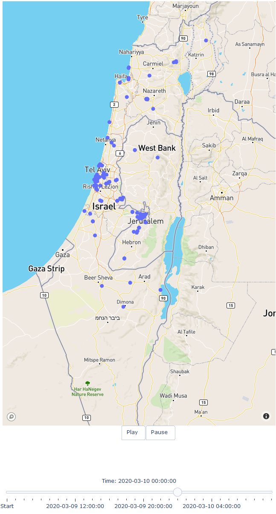

# What's this?
Visualize the spread of Covid-19 virus, as per the official data given by the Israeli Ministry of Health.

This is a cumulative view. At each point in time we see all previous points.

Each point is a place an infected person has visited.

configuration is taken from [here](https://github.com/MohGovIL/hamagen-react-native/tree/master/src/config)

# Requirements
```pip3 install -r requirements.text```

You can set `.mapbox_token` to your token to get a nicer map (otherwise we use open street view). Generation of a token is free.


# Demo
